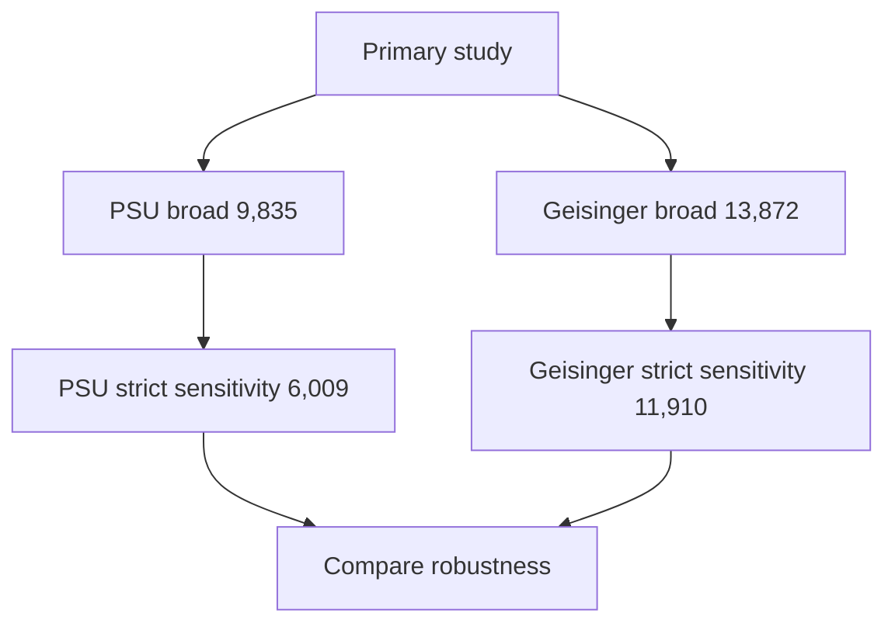

# Final findings and decisions

This page contains the conclusions that should guide future work. It is shorter than the experiment log and should be treated as the current scientific summary.

## 1. Primary cohort

Use the harmonized **broad cohort** as the main analysis population.

- PSU broad: **9,835**
- Geisinger broad: **13,872**

Imaging and lipid evidence do not silently remove patients from the broad cohort.

## 2. Strict phenotype

Use the evidence-qualified strict phenotype as a sensitivity/replication analysis.

- PSU strict: **6,009**
- Geisinger strict: **11,910**

Strict means: among all qualifying stroke encounters, require both qualifying neuroimaging and qualifying lipid evidence, then select the first strict-qualified encounter.

## 3. Why Geisinger strict is 11,910

The exact legacy Aabila Geisinger selection was reproduced using:

- imaging window: 2 days before admission through discharge;
- lipid window: admission through discharge;
- validated 214-code lipid whitelist;
- filter-before-index selection;
- legacy first-row/grouping behavior.

The exact replay matched all 11,910 saved encounter selections.

## 4. ATN registry file

Do **not** use `ATN_reg_ptid.csv` to filter the current Geisinger replay or production cohort. Its identifier namespace does not overlap the transformed patient IDs used in the compared data.

## 5. Diagnosis differences

Do not interpret a different selected `DX` between pipelines as automatic evidence that one pipeline is wrong.

At both sites, raw review showed many encounters with multiple qualifying primary stroke diagnosis codes. Row ordering and tie behavior can choose different codes from the same source encounter.

Current decision:

- retain broad `DX`;
- expose ambiguity counts and deterministic companion DX;
- do not overwrite broad `DX` only to match legacy ordering.

## 6. PSU registry

The current harmonized PSU primary cohort is **not registry gated**.

Registry data may augment provenance and matched events, but the harmonized runtime configuration must not restrict diagnosis rows to registry patients.

Historical registry-gated behavior remains useful only for explicit replication.

## 7. PSU procedure semantic type

For imaging/rehabilitation evidence in the harmonized PSU data, use `RAW_PX_TYPE`, not normalized `PX_TYPE`.

The normalized field contains PCORnet categories rather than the semantic CPT/HCPCS type required by the evidence logic.

## 8. Sensitivity-field meanings

- `phenotype_strict_eligible`: at least one strict-qualified stroke encounter exists.
- `has_alt_qualifying_stroke_encounter`: another strict-qualified encounter exists besides the broad index.
- `index_selection_sensitive`: the selected strict index is different from the broad index.

These fields answer different questions.

## 9. Strict index caution

Subsetting broad data to `phenotype_strict_eligible == 1` is a valid patient-subset sensitivity analysis.

However, if a study uses `strict_index_stroke_date` as the actual index date, time-dependent covariates and outcomes should be recalculated relative to that strict index.

## 10. Imputation

Do not use imputed datasets to assess cross-pipeline equivalence. The advanced imputation procedure can be stochastic.

Use observed/unimputed datasets for:

- missingness assessment;
- cohort validation;
- cell-level equivalence checks.

## 11. Geisinger ICU

The earlier 0% ICU result was a data-field mismatch, not a real clinical result.

Relevant Geisinger ICU department records have `ENC_DT` populated while interval timestamps are missing.

Current validated rule:

- clean ICU/critical-care department match with word boundaries;
- `DEP_GROUPING == INPATIENT`;
- `ENC_DT` between broad index admission and discharge.

Current benchmark: **431 / 13,872 (3.11%)**.

## 12. Outcome comparability

A harmonized outcome concept does not always mean identical raw ascertainment.

Important example:

- PSU ICU: CPT/procedure evidence.
- Geisinger ICU: inpatient ICU department event.

Publications should describe this difference.

## 13. Final analysis hierarchy

## 14. What should not be done

Do not:

- replace the broad cohort only because a legacy pipeline was narrower;
- report the discarded ±7-day Geisinger evidence-window hypothesis;
- filter Geisinger using the ATN file;
- treat `has_alt_qualifying_stroke_encounter` as identical to `index_selection_sensitive`;
- propagate patient-level sensitivity fields into lab/comorbidity/encounter matrices;
- mix cohort and outcome files from different runs;
- assume a zero readmission/ED outcome proves complete outside-system follow-up.
