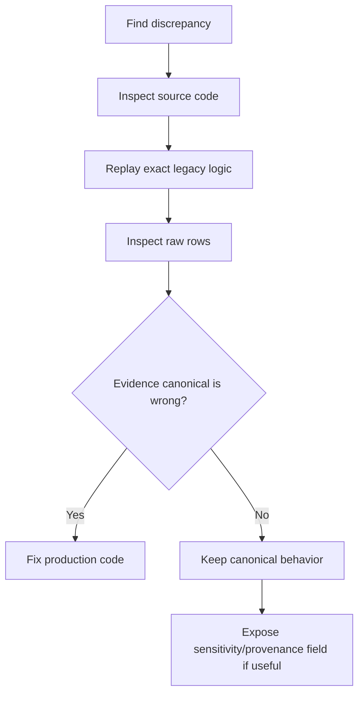

# PROMIS validation documentation

This repository records the scientific validation work used to understand differences between the canonical PROMIS stroke pipeline and earlier PSU/Geisinger implementations.

Read these pages in order:

1. **[EXPERIMENT_LOG.md](EXPERIMENT_LOG.md)** — chronological experiments, what each test asked, and what it found.
2. **[FINDINGS_AND_DECISIONS.md](FINDINGS_AND_DECISIONS.md)** — final scientific conclusions and decisions.
3. **[SCRIPT_MAP.md](SCRIPT_MAP.md)** — which scripts are historical, diagnostic, or final, and when to use them.

## Purpose of this repository

This repository is **not** the production pipeline. It is an audit and validation workspace.

The production implementation lives in `TheDecodeLab/PROMIS-ML-pipeline`.

The validation repository was used to answer questions such as:

- Does the canonical cohort reproduce older pipelines when the same rules are used?
- Which differences are caused by different phenotype definitions?
- Which differences are caused by row ordering or diagnosis tie-breaking?
- Are imaging/lipid filters applied before or after index selection?
- What evidence windows did the legacy Geisinger pipeline actually use?
- Does the ATN registry file explain the Geisinger cohort?
- Which fields should become sensitivity/provenance metadata rather than silently changing the canonical cohort?

## Core principle

A legacy pipeline is a **comparison target**, not automatically the scientific truth.

When a discrepancy is found, the workflow is:

Generated patient-level results and reproduced datasets remain local and should not be committed.
