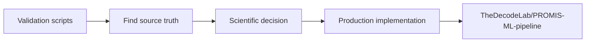

# Validation script map

This page explains why the scripts exist and which ones should be considered final references.

## Final / preferred reference scripts

| Script | Purpose | Status |
|---|---|---|
| `replay_aabila_exact_selection_v5.py` | Exact replay of legacy Geisinger strict selection | **Final validated replay** |
| `final_scientific_validation.py` | Consolidated scientific validation checks | Final reference |
| `final_targeted_adjudication.py` | Targeted raw-data adjudication of remaining discrepancies | Final reference |
| `source_truth_audit.py` | Trace discrepancies back to raw/source rows | Final reference |
| `raw_discrepancy_adjudication.py` | Raw diagnosis discrepancy review | Final reference |
| `tests/test_sensitivity_flag_semantics.py` | Tests meanings of sensitivity flags | Current semantic test |

## Baseline comparison scripts

| Script | Purpose |
|---|---|
| `compare_aabila.py` | General canonical-versus-Aabila comparison framework |
| `compare_geisinger.py` | Initial Geisinger comparison |
| `compare_psu_registry_only.py` | PSU comparison restricted to registry-centered overlap |
| `compare_psu_registry_outcomes.py` | PSU outcome comparison on shared registry patients |
| `compare_geisinger_aabila_aligned.py` | Geisinger comparison after partial semantic alignment |
| `compare_geisinger_aligned_full.py` | Broader aligned Geisinger comparison |

These are useful for reproducing the investigation but should not be interpreted as the final phenotype definition by themselves.

## Diagnostic / tracing scripts

| Script | Purpose |
|---|---|
| `audit_aabila_geisinger_code.py` | Inspect old Geisinger code paths and assumptions |
| `audit_geisinger_cohort.py` | Inspect cohort-stage differences |
| `audit_psu_exceptions.py` | Inspect PSU discrepancy exceptions |
| `inspect_aabila_strict_semantics.py` | Determine exact legacy strict-filter semantics |
| `trace_aabila_candidate_selection.py` | Trace how legacy Geisinger candidates survive each filter |
| `trace_psu_cohort.py` | Trace PSU cohort selection |

## Historical closeout/follow-up scripts

| Script | Meaning |
|---|---|
| `closeout_validation_audit.py` | Earlier closeout attempt |
| `closeout_validation_audit_fixed.py` | Corrected closeout version |
| `scientific_accuracy_followup.py` | Earlier follow-up analysis |
| `scientific_accuracy_followup_fixed.py` | Corrected follow-up helper |
| `scientific_accuracy_followup_v2.py` | Later follow-up iteration |

When both an original and `fixed`/later version exist, prefer the corrected/later version unless reproducing the historical debugging sequence.

## Sensitivity prototypes

| Script | Status |
|---|---|
| `prototype_sensitivity_flags.py` | Early prototype |
| `prototype_sensitivity_flags_v2.py` | Intermediate prototype |
| `prototype_sensitivity_flags_v3.py` | Intermediate prototype |
| `prototype_sensitivity_flags_v4.py` | Latest validation prototype before production transfer |

These scripts were used to develop semantics that were later implemented in the production repository. They are not the production source of truth.

## Exact replay versions

| Script | Status |
|---|---|
| `replay_aabila_exact_selection_v3.py` | Historical replay iteration |
| `replay_aabila_exact_selection_v4.py` | Historical replay iteration |
| `replay_aabila_exact_selection_v5.py` | **Validated exact replay** |

Use v5 for current interpretation. Earlier versions are retained because they show how incorrect assumptions were identified and corrected.

## Important code-reading notes

### `replay_aabila_exact_selection_v5.py`

The ATN registry overlap check is diagnostic only. It must not become a cohort filter because the ATN IDs do not share the transformed PATID namespace.

The 214-code lipid whitelist is essential to exact replay.

The script intentionally reproduces legacy ordering/grouping behavior. That does not mean production code should copy every legacy row-order side effect.

### Prototype sensitivity scripts

Counts from early prototypes are not all final acceptance targets. The final production rule uses **filter-before-index** semantics.

### Generated outputs

Files under local `results/` and reproduced dataset folders can contain patient identifiers. They are intentionally ignored by Git and should remain local.

## Relationship to production

If validation and production documentation disagree, investigate the current production commit and the latest validation decision before changing code.
